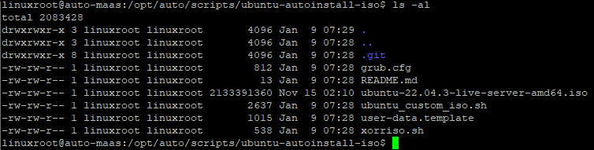
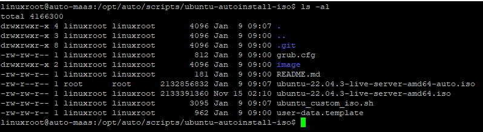
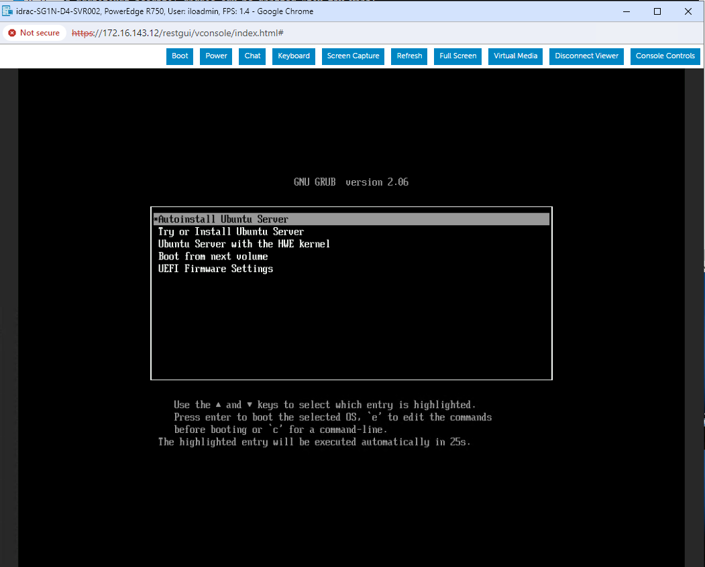
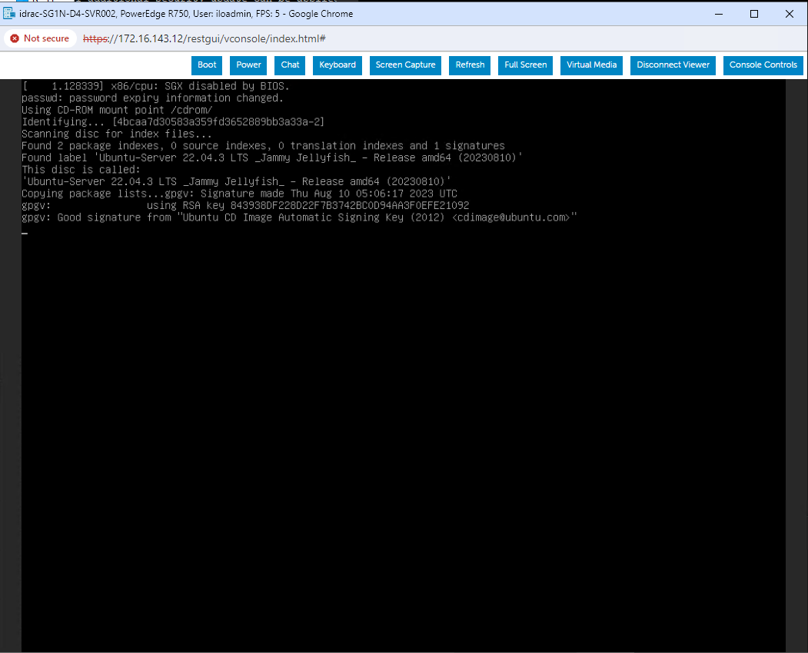
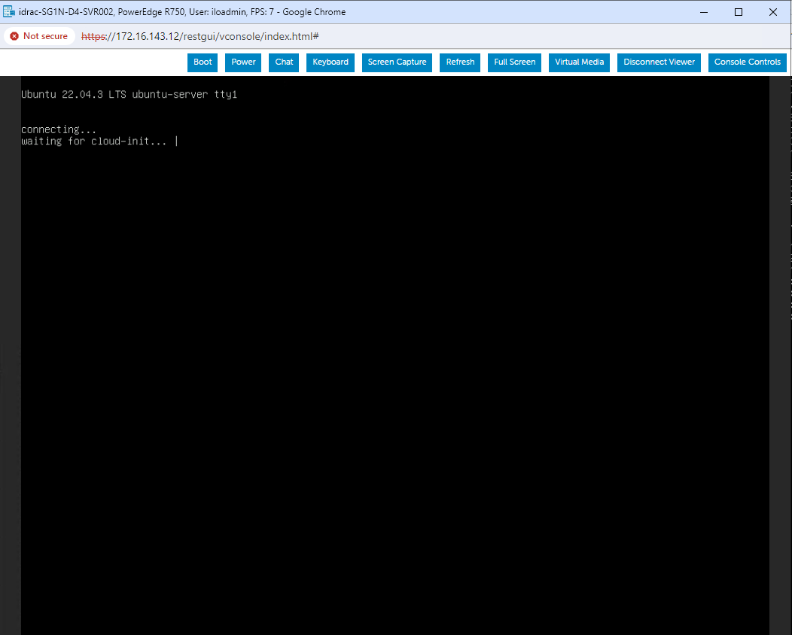
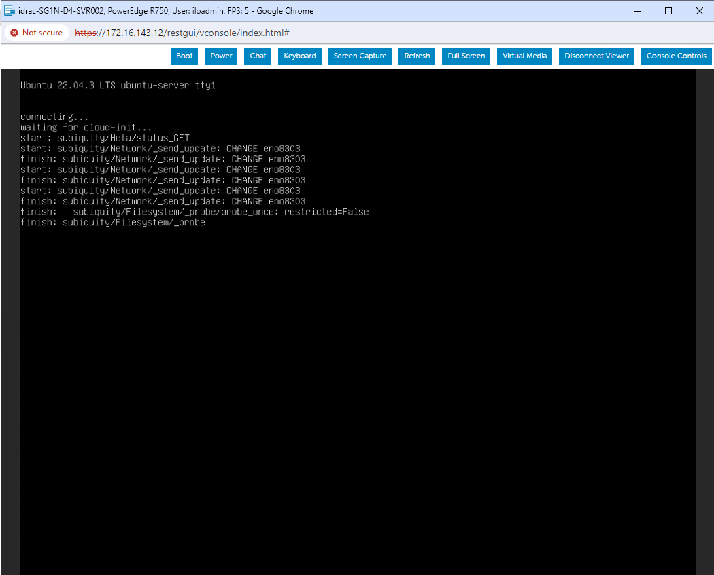
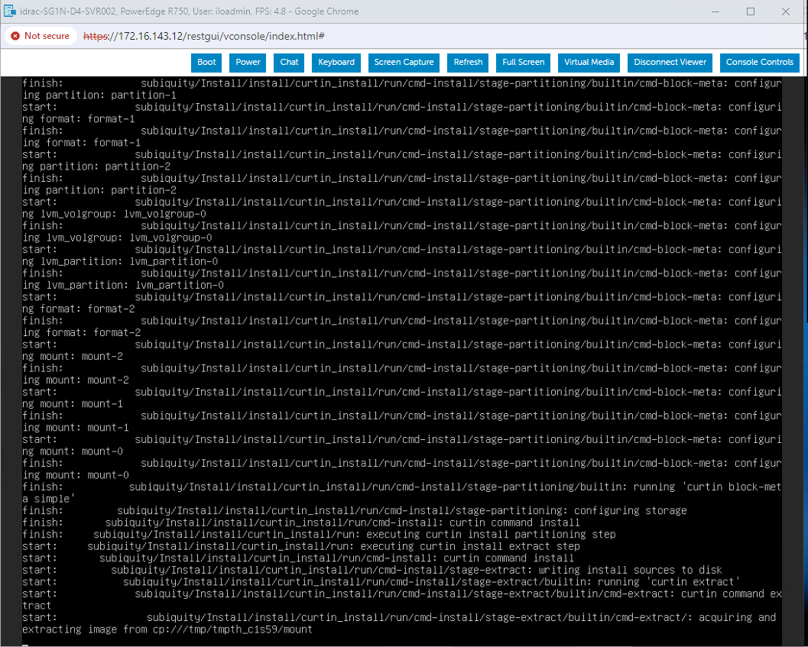

# ubuntu_iso

```bash
git clone https://github.com/hhai-le/ubuntu-autoinstall-iso.git
cd ubuntu-autoinstall-iso
```

upload Ubuntu ISO to this folder



change password in user-data-temp with:

```bash
openssl passwd -6
```

Example:

```yaml
#cloud-config
autoinstall:
...
  identity:
...
    password: $6$6NbWpnzt6ZByj4Ov$ghwr81Kzx1JcRzcRAXoz7ymiRo62Xgpbbwr/nnHLrkp3gYmyEILFfJZRpfZ/rA3bwGJu6bwsCbm
```


```bash
sudo bash ubuntu_custom_iso.sh \
-i ubuntu-22.04.3-live-server-amd64.iso \
-u user-data-temp \
-a 192.168.86.132 \
-m 255.255.255.0 \
-g 192.168.86.1 \
-n ubuntu-autolab \
-d 172.16.11.5
```

after run above script



Booting with this ISO










