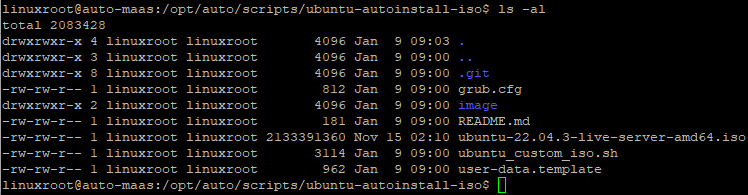

# ubuntu_iso

```bash
git clone https://github.com/hhai-le/ubuntu-autoinstall-iso.git
cd ubuntu-autoinstall-iso
```

upload Ubuntu ISO to this folder



```bash
sudo bash ubuntu_custom_iso.sh \
-i ubuntu-22.04.3-live-server-amd64.iso \
-u user-data.template \
-a 192.168.86.132 \
-m 255.255.255.0 \
-g 192.168.86.1 \
-n ubuntu-autolab \
-d 192.168.86.1
```

after run above script


Booting with this ISO


